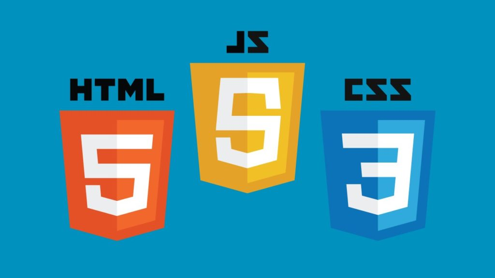

# Sans React

## Le navigateur

Un navigateur web est un logiciel permettant de consulter et afficher le Web. Il dialogue à minima en HTTP.

Il utilise principalement 3 langages :



- `HTML` pour la structure des documents
- `CSS` pour la présentation des documents
- `Javascript` pour le dynamisme des documents

## HTML

Le HyperText Markup Language, généralement abrégé HTML ou, dans sa dernière version, HTML5, est le langage de balisage conçu pour représenter les pages web.

```html
<!DOCTYPE html>
<html>
  <head>
    <title>Ma page Web</title>
  </head>
  <body>
    <p>Un paragraphe</p>
    <p class="mes-paragraphes">Un autre paragraphe</p>
  </body>
</html>
```

## CSS

Les feuilles de style en cascade, généralement appelées CSS de l'anglais Cascading Style Sheets, forment un langage informatique qui décrit la présentation des documents HTML et XML.

```css
p {
  color: red;
}

.mes-paragraphes {
  color: blue;
}
```

## JavaScript

JavaScript est un langage de programmation de scripts principalement employé dans les pages web interactives et à ce titre est une partie essentielle des applications web.

```js
let str = "Hello";
if (str.startsWith("H")) {
  alert(str);
}
```

## DOM

Le Document Object Model (DOM) est une interface de programmation normalisée par le W3C, qui permet à des scripts d'examiner et de modifier le contenu du navigateur web1.

```js
// Sélectionné l'élément avec l'identifiant "root"
const root = document.getElementById("root");
// Crée un nouvel élément html de type "main" (il n'est pas encore ajouté à la page)
const main = document.createElement("main");
// Modifie le contenu textuel de l'élément main créé ci-dessus
main.innerText = "COUCOU";
// Rajoute notre élément main en tant qu'enfant de l'élément séléctionné précédemment
root.appendChild(main);
```

L'interface `Document` est présentée sur [mdn web docs](https://developer.mozilla.org/fr/docs/Web/API/Document).

# Objectif

## Lancer l'application

Pour récupérer le code source de l'application, il est nécessaire de cloner le repo github :

```sh
git clone https://github.com/ptitFicus/react-hands-on.git
cd react-hands-on
```

Puis pour vous positionner au début de la première étape :

```sh
git checkout etape-0
```

Installer ensuite les dépendances puis lancer l'application :

```sh
npm i
npm run dev
```

## Objectif

A l'aide de la fonction `artistsWithAlbum` du fichier `utils/utils.js`, sur la page un tableau comprenant tous les artistes est déjà créé.
Pour chaque artiste ajouter une colonne indiquant le compte de ses albums en modifiant la fonction `makeTable`.

Le code de cette étape est à réaliser dans le fichier `main.jsx`.

```html
<table>
  <thead>
    <tr>
      <td>Artist (2)</td>
      <td>Albums</td>
    </tr>
  </thead>
  <tbody>
    <tr>
      <td>AC/DC</td>
      <td>2</td>
    </tr>
    <tr>
      <td>Michel Sardou</td>
      <td>No albums</td>
    </tr>
  </tbody>
</table>
```

Voici un extrait des données rénvoyées par la fonction `artistsWithAlbum` :

```json
[
  {
    "name": "AC/DC",
    "albums": ["For Those About To Rock We Salute You", "Let There Be Rock"]
  },
  { "name": "Aaron Goldberg", "albums": ["Worlds"] }
]
```

## Bonus

Modifier la fonction `makeTable`, qui fait un tableau et qui prend en paramètres un tableau de données, et les colonnes du tableau en utilisant les concept suivant :

- [destructuration de tableaux](https://developer.mozilla.org/en-US/docs/Web/JavaScript/Reference/Operators/Destructuring_assignment)
- [parcours et transformation de tableaux](./javascript.md#manipulation-de-tableaux)
