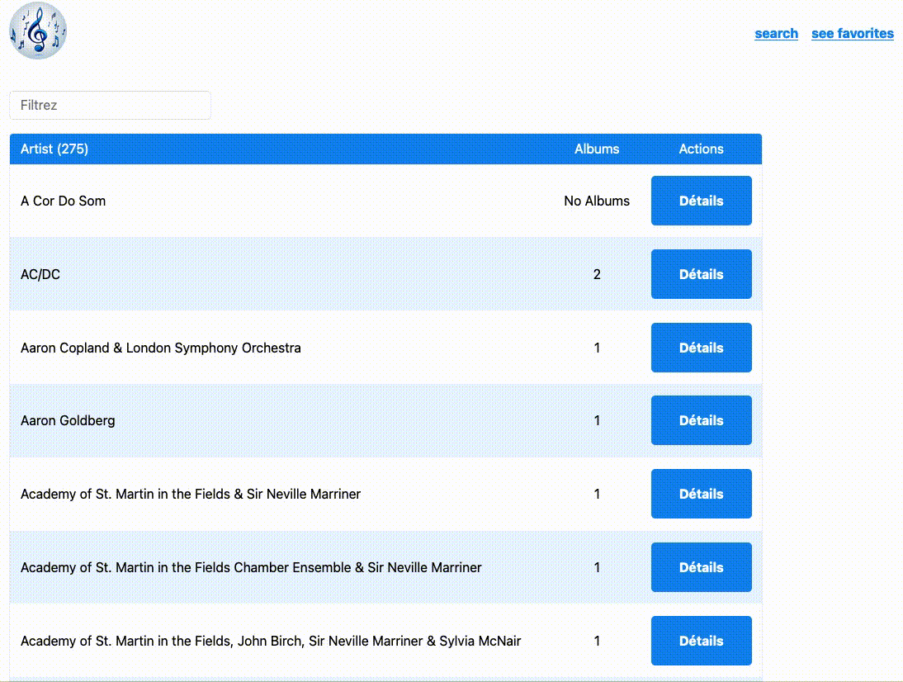

# State et props

## Props

Les composants React utilisent des props pour communiquer entre eux. Chaque composant parent peut passer des informations à ses composants enfants en leur donnant des props. Les props vous rappellent peut-être les attributs HTML, mais vous pouvez y passer n’importe quelle valeur JavaScript, y compris des objets et des fonctions.

```jsx
function Avatar({ person, size }) {
  return (
    
  );
}

export default function Profile() {
  return (
    <div>
      <Avatar
        size={100}
        person={{
          name: "Katsuko Saruhashi",
          imageId: "YfeOqp2",
        }}
      />
      <Avatar
        size={80}
        person={{
          name: "Aklilu Lemma",
          imageId: "OKS67lh",
        }}
      />
      <Avatar
        size={50}
        person={{
          name: "Lin Lanying",
          imageId: "1bX5QH6",
        }}
      />
    </div>
  );
}
```

Les props permettent également une forme de communication enfant -> parent grâce au passage de fonction de callback.

```jsx
function MySuperForm({ submit }) {
  return (
    <form
      onSubmit={(e) => {
        // évite de rafraîchir la page au submit
        e.preventDefault();
        // Call parent function with form values
        submit(e.target.user.value);
      }}
    >
      <label>
        Name
        <input type="text" name="user" />
      </label>
      <button type="submit">Valider</button>
    </form>
  );
}

function ParentComponent() {
  return <MySuperForm submit={(username) => console.log(username)} />;
}
```

## useState

useState est un Hook React qui ajoute une variable d’état dans votre composant.

### Aparté sur les hooks

useState est le premier hook que nous rencontrons, nuos en croiserons quelques autres par la suite. Les hooks sont des fonctions permettant de conserver un état local dans un composant, d'exécuter des actions au changement de certaines props, ...

Les hooks sont reconnaissables facilement car ils commencent tous par `use`.

Ils peuvent sembler magiques au premier abord (et même aux deuxième et troisièmes abords !), pour l'instant, il vous suffit de savoir que les hooks ne peuvent pas être utilisés n'importe comme, leur utilisation doit satisfaire une règle :

> Les hooks doivent être appelés au "top level" (à la racine) des composants (ou des hooks customs) dans lesquels ils sont utilisés.

Concrètement, cela veut dire qu'un hook ne peut pas être appelé :

- dans une boucle
- dans un if
- dans une fonction de callback

### Revenons à useState

Le hook useState renvoie un tableau contenant deux éléments :

1. La valeur actuelle de la variable d'état
2. Une fonction permettant de modifier la variable d'état, déclenchant un nouveau rendu du composant

```js
const [state, setState] = useState(initialState);
```

```jsx
export default function Form() {
  const [firstName, setFirstName] = useState("");
  const [lastName, setLastName] = useState("");

  const fullName = firstName + " " + lastName;

  function handleFirstNameChange(e) {
    setFirstName(e.target.value);
  }

  function handleLastNameChange(e) {
    setLastName(e.target.value);
  }

  return (
    <>
      <h2>Enregistrez-vous :</h2>
      <label>
        Prénom : <input value={firstName} onChange={handleFirstNameChange} />
      </label>
      <label>
        Nom : <input value={lastName} onChange={handleLastNameChange} />
      </label>
      <p>
        Votre billet sera au nom de : <b>{fullName}</b>
      </p>
    </>
  );
}
```

# Objectif

Si vous n'avez pas eu le temps de finaliser l'étape précédente ou souhaitez repartir d'une base saine, positionnez vous sur la branche `etape-1`.

Ajouter une troisième colonne au tableau. Elle comprend un bouton `Display` permettant d'afficher le détail d'un artiste : son nom et la liste de ses albums.
Lorsqu'un artiste est affiché, un bouton permet de fermer le détail.

## Résultat attendu



## Bonus

Créer un champ texte permettant de filtrer la liste des artistes.
