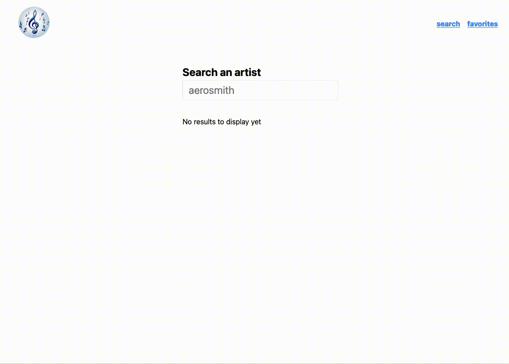

# Recherche asynchrone

Si vous n'avez pas eu le temps de finaliser l'étape précédente ou souhaitez repartir d'une base saine, positionnez vous sur la branche `etape-4`.

On cherche à charger les artistes comme s'ils venaient d'un serveur distant.
La fonction `search` du fichier `utils.js` réalise la recherche.

Elle retourne une promise, voici un exemple d'utilisation :

```js
import { search } from "./utils/utils";

// ...
search("aero").then((result) => {
  console.log("search result", result);
});
```

## Objectif

Il faut ajouter un champ texte, qui va à chaque changement interroger la liste des artistes et permettre l'affichage du tableau.

Rien de très nouveau dans cette étape, il s'agit de réutiliser tout ce que vous avez apris dans les étapes précédentes ;)

Essayez de réaliser l'implémentation la plus simple possible (celle utilisant le moins de hooks possible).

## Résultat attendu



## Bonus

- implémenter un loader en attendant le chargement des résultats. Un indicateur est fourni qui peut être affiché de la manière suivante : `<div className="loader"/>`
- utiliser du [debounce](https://medium.com/@AbbasPlusPlus/til-what-is-debouncing-and-how-to-use-it-in-react-43dfd8eafc1a) pour la recherche, pour éviter que le résultat d'une requête partie avant n'arrive après (provoquant un résultat affiché "faux" car incohérent)

## Super Bonus

- utiliser les [loader](https://reactrouter.com/en/main/route/loader) de react-router pour charger les données à l'entrée sur la route, et donc éviter de gérer cette logique dans le composant, l'idée ici est de positionner la recherche courante dans le "search" de l'URL (par exemple `http://localhost:3000?search=aerosmith`). Pour positionner / lire ces paramètre, on peut utiliser le hook [useSearchParams](https://reactrouter.com/en/main/hooks/use-search-params) fourni par react-router.
